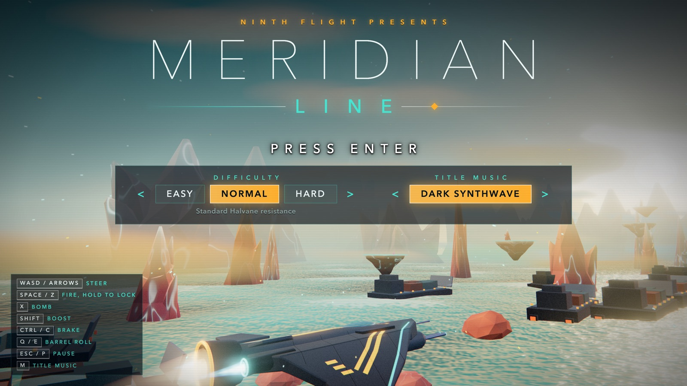
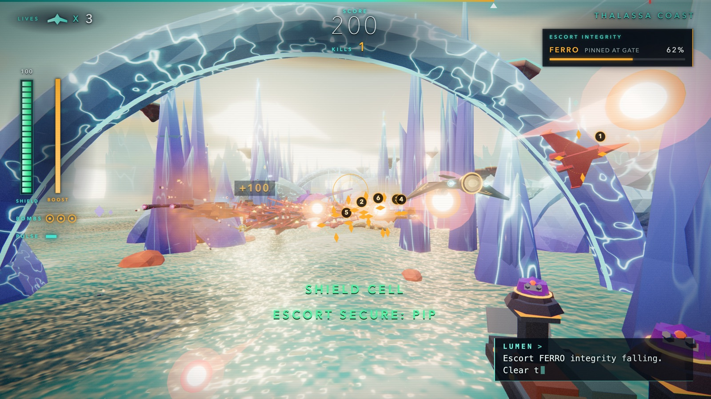

# MERIDIAN LINE

An on-rails 3D space shooter for the browser. You fly the Vanta Mk II with NINTH FLIGHT through the Meridian Reach, a chain of colonised worlds, against the Halvane Dominion and the ancient AI that rules it, the Regent.

Built with three.js (r170) and Vite. Everything is procedural: geometry from primitives, textures from canvas, sound effects and music synthesised with WebAudio. The game itself loads no image, model or audio files (the screenshots in `docs/` are only for this page).

**Play it:** https://bop-del.github.io/meridian-line/

## Controls

| Action | Keys |
|---|---|
| Steer | WASD or arrow keys |
| Fire | Space or Z. Hold about 0.6 s over enemies to charge and lock on, release for a homing volley |
| Bomb | X |
| Boost / brake | Shift / Ctrl or C |
| Barrel roll (deflects incoming fire) | Q / E, or double tap A / D |
| Pause | Esc or P |
| Mouse aim | M toggles it in flight. Left button fires, right button bombs |
| Title screen | Enter starts. M cycles the title music |

A gamepad works too: sticks to steer and aim, triggers and shoulders for fire, boost, brake and roll, Start to pause.

Control tips appear as a small prompt line at the bottom of the screen (`ctx.ui.hint`).

## Features

- Three levels, each ending in a multi-phase boss fight
- Lock-on volley, smart bomb, barrel roll that deflects enemy fire (and reflects some shells back), boost and brake
- Pickups: SHIELD CELL (heals, laid out along a slipstream lane in chains of four with a bonus on the fourth), CAPACITOR (rare, one per level in a detour, raises maximum shield and heals fully), PULSE UPGRADE (weapon upgrade), BOMB and REPAIR
- Two escort pilots (VEX, FERRO) and an escort drone (PIP) who fly beside you. They get into trouble in different ways (pinned, disabled, cut off, tailed) and an ESCORT INTEGRITY readout shows the time left to clear the contact
- Comm traffic in three forms: pilot portraits (VEX, FERRO, and the enemy AI REGENT), typed text readouts (PIP, LUMEN, SABLE) and a text-only dispatch card from CONTROL
- KILLS counter and combo multiplier during play, and a per-level results screen with a letter rank (S, A, B or C) from score against par, shield remaining, lives lost, time and escorts still flying
- Three difficulties: easy, normal, hard
- Synthesised soundtrack with layered intensity, three selectable title themes and spatialised effects
- Post-processing (bloom, grade, FXAA) with adaptive quality that lowers resolution on slow GPUs

## The levels

| # | Level | Boss | Look |
|---|---|---|---|
| 1 | THALASSA COAST: a strike on a Dominion landing fleet | The Tidebreaker, a siege barge held by three mooring cables. Cut the cables, then reflect its siege shell with a barrel roll or shoot the armour off | Teal water, twin gold suns, coral spires and reef arches |
| 2 | THE CINDER BELT: through the burning debris | The Orrery, a ring-shaped warship with rotating segments and a sweeping beam | Ember-red debris with glowing cracks against a dark cyan void |
| 3 | OBSIDIAN FOUNDRY: the Regent's forge | The Regent, a crystalline sovereign core encircled by four orbital prism emitters that only take damage while their lens is open | Black glass, molten metal, blue-white smelter beams |

## Run locally

Requires Node 20.11 or newer (Node 22 is used in CI).

    npm install
    npm run dev        # http://localhost:5173
    npm run build      # production bundle in dist/
    npm run preview    # serve dist/ on http://localhost:4173

The build uses relative asset paths (`base: './'`), so the contents of `dist/` can be hosted from any folder or sub path. A GitHub Actions workflow (`.github/workflows/pages.yml`) builds and deploys to GitHub Pages on every push to `main`.

## Project layout

    src/core/       game loop and phases, input, rail, collision, camera rig
    src/entities/   the player controller and projectiles
    src/world/      levels, sky, scenery, obstacles, pickups (shield cells, capacitor), level script runner
    src/enemies/    enemy types, formations, bosses
    src/allies/     escort AI (two pilots and a drone)
    src/models/     procedural ship models
    src/render/     renderer, bloom, grade pass
    src/fx/         pooled particles, explosions, debris, speed streaks
    src/ui/         HUD, menus, comm box and text readouts, portraits
    src/audio/      synth, sound effects, sequenced music, title themes
    music-lab.html  page for auditioning the title themes
    tools/          headless test helpers (system Chrome through puppeteer-core)
    docs/           architecture notes

See [docs/ARCHITECTURE.md](docs/ARCHITECTURE.md) for how the modules fit together.

## Testing helpers

URL parameters: `?autostart=1`, `?level=0|1|2`, `?god=1`, `?difficulty=easy|normal|hard`, `?title=a|b|c`. `window.__ctx` exposes the game context, and `__ctx.game.advance(seconds)` steps the simulation deterministically.

    node tools/shot.mjs <url> <out.png> [waitMs]      # screenshot plus console error check
    node tools/bossbot.mjs <port> <outDir> [0,1,2]    # aimbot through each boss to level complete
    node tools/flow.mjs <port> <outDir>               # title, pause, level complete, game over, restart
    node tools/gpushot.mjs <url> <out.png>            # screenshot on the real GPU (Metal) instead of the software renderer
    node tools/gpuflicker.mjs <baseUrl> off 10        # black-pixel fraction over many frames

The tools launch Google Chrome from the macOS default path, or from the `CHROME_PATH` environment variable if it is set (for example `CHROME_PATH=/usr/bin/google-chrome node tools/flow.mjs 5173 out`), and expect a running dev server. Headless Chrome uses a software renderer and runs at a few frames per second, so the tests step simulated time instead of waiting.

## Status and known limits

- Checked headless: no console errors, all three bosses beatable, full screen flow (title, pause, level complete, game over, restart).
- Checked on an Apple silicon GPU (Metal): about 16.7 ms per frame and no rendering artefacts on any level or boss arena.
- Designed for desktop with a keyboard first. A gamepad is supported. There are no touch controls.
- Needs a browser with WebGL2.
- Not measured: steering feel across different setups, and how the audio sounds on different hardware.
- MSAA is off by default because it caused flickering black blocks on Apple GPUs. `?msaa=rt2` or `?msaa=both` turn it on for comparison.

## Licence

MIT, see [LICENSE](LICENSE).
